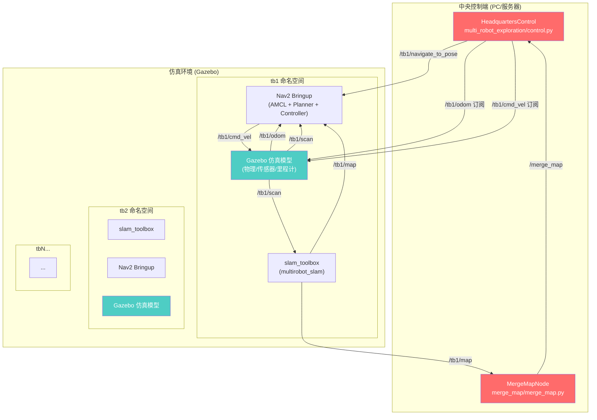
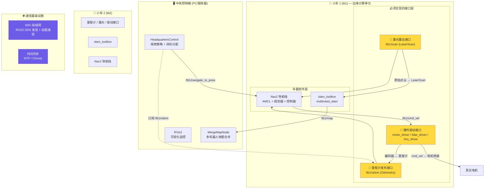
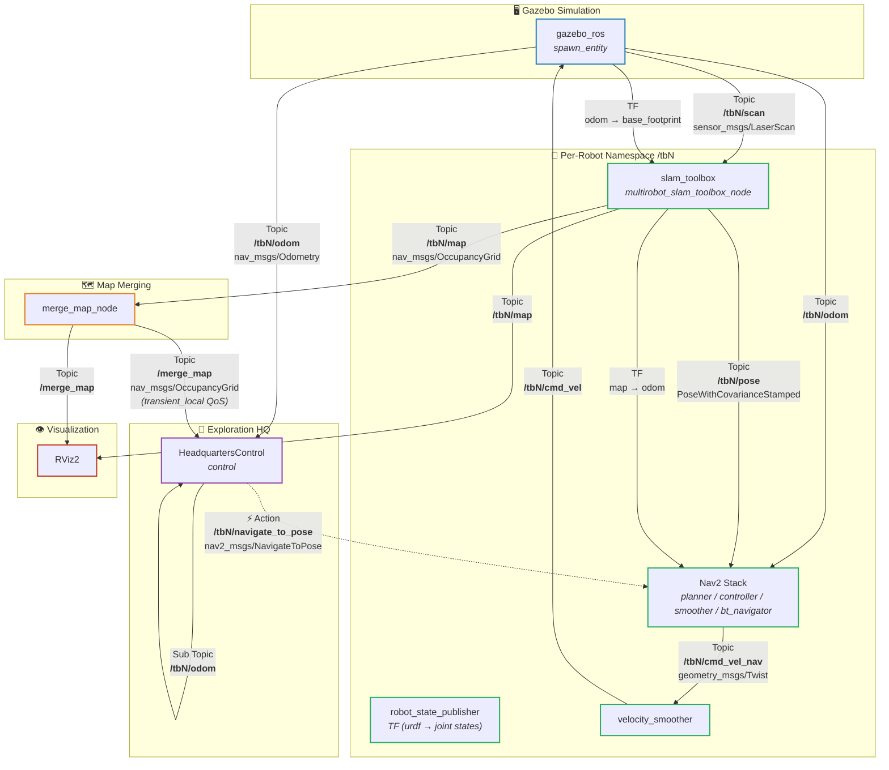

### 当前系统架构总览




### 真实小车架构与接口需求






---

## 详细接口分析

根据对项目源码的深入分析，当前系统在 Gazebo 仿真中由 Gazebo 自动提供了物理仿真、传感器仿真和里程计。迁移到真实小车后，需要创建以下 **六大类接口**：

---

### 🔌 一、硬件驱动接口（每个小车必备，仿真中由 Gazebo 提供）

这是最核心的改动——需要为真实硬件编写 ROS2 驱动节点：

| 接口              | ROS2 消息类型                                 | 方向            | 说明                                                         |
| ----------------- | --------------------------------------------- | --------------- | ------------------------------------------------------------ |
| **电机驱动**      | 订阅 `cmd_vel` → 输出 PWM/转速指令            | 上位机 → 下位机 | 接收 Nav2 控制器发出的 `/tb{id}/cmd_vel` (`geometry_msgs/Twist`)，转换为真实电机的控制信号（串口/CAN/PWM） |
| **编码器/里程计** | 发布 `/tb{id}/odom` (`nav_msgs/Odometry`)     | 下位机 → 上位机 | 读取轮式编码器或IMU，融合发布里程计信息                      |
| **激光雷达驱动**  | 发布 `/tb{id}/scan` (`sensor_msgs/LaserScan`) | 传感器 → 上位机 | 驱动真实 LiDAR（如 RPLIDAR、YDLIDAR），发布标准 LaserScan    |
| **IMU（可选）**   | 发布 `/tb{id}/imu` (`sensor_msgs/Imu`)        | 传感器 → 上位机 | 如果使用 robot_localization 做里程计融合时需要               |

> 💡 如果你使用 TurtleBot3 真实小车，这些驱动大部分已有现成的 ROS2 包（`turtlebot3_node`、`hls_lfcd_lds_driver` 等）。如果是自研小车，需要自己实现。

---

### 🗺️ 二、SLAM 建图接口（已有，但需调整参数）

当前项目使用 slam_toolbox 的 `multirobot_slam_toolbox_node`，这个接口已经存在：

| 接口                                         | 说明                     |
| -------------------------------------------- | ------------------------ |
| **输入**: `/tb{id}/scan`                     | 激光雷达数据             |
| **输入**: `/tb{id}/tf` (odom→base_footprint) | 里程计变换               |
| **输出**: `/tb{id}/map` (`OccupancyGrid`)    | 每个机器人发布的局部地图 |
| **输出**: `/tb{id}/tf` (map→odom)            | 地图到里程计的变换       |

**真实小车需要调整的地方**：
- 修改 `use_sim_time` 为 `false`
- 根据真实 LiDAR 参数调整 `mapper_params_online_multi_async.yaml` 中的扫描范围、分辨率等

---

### 🧭 三、Nav2 导航栈接口（已有，需配置）

每个小车运行的 Nav2 导航栈，包含 AMCL 定位 + 路径规划 + 运动控制：

| 接口                                 | 类型                                    | 说明                                                         |
| ------------------------------------ | --------------------------------------- | ------------------------------------------------------------ |
| **输入**: `/tb{id}/navigate_to_pose` | **Action** (`nav2_msgs/NavigateToPose`) | 中央控制节点发送导航目标，这是 control.py 中 `send_goal()` 使用的核心接口 |
| **输出**: `/tb{id}/cmd_vel`          | Topic (`geometry_msgs/Twist`)           | 控制器计算的速度指令，发给电机驱动                           |
| **输入**: `/tb{id}/odom`             | Topic                                   | 里程计信息                                                   |
| **输入**: `/tb{id}/scan`             | Topic                                   | 激光数据                                                     |
| **输入**: `/tb{id}/map`              | Topic                                   | SLAM 地图                                                    |

**真实小车需要调整**：
- 将 `use_sim_time` 改为 `false`
- 修改 AMCL 的 `initial_pose` 为真实初始位置（或通过 RViz 手动设置 `2D Pose Estimate`）
- 调整 `robot_model_type`、`base_frame_id`、`odom_frame_id` 等参数以匹配真实机器人
- 根据真实电机性能调优控制器参数（`FollowPath`、`RotationShimController` 等）

---

### 🗺️ 四、地图合并接口（已有，无需改动）

merge_map 包从各小车订阅 `/tb{id}/map`，发布合并后的 merge_map 给控制中心。这个在真实和仿真下完全一致，只需确保网络通信正常。

---

### 🌐 五、**通信基础设施（仿真不需要，真实必须）**

这是仿真与真实最大的区别之一：

| 需求              | 说明                                            | 实现方式                                                     |
| ----------------- | ----------------------------------------------- | ------------------------------------------------------------ |
| **ROS2 多机通信** | 中央PC需要与每台小车上的计算单元通信            | 配置 `ROS_DOMAIN_ID` 一致；使用 ROS2 的 DDS 自动发现机制；或配置 `ROS_DISCOVERY_SERVER` 减少带宽 |
| **WiFi 网络**     | 所有设备在同一局域网                            | 部署一个稳定的 WiFi 路由器；建议使用 5GHz 频段减少干扰       |
| **时间同步** ⚠️    | 关键！SLAM、传感器融合、TF 变换都需要精确时间戳 | 中央PC作为 NTP Server，各小车通过 `chrony` 或 `ntpd` 同步时间 |
| **命名空间隔离**  | 每个小车的话题需要命名空间区分                  | 当前已使用 `/tb{id}/` 命名空间，直接适用                     |

> ⚠️ **时间同步是最容易出问题的环节**。当前仿真中所有节点共享同一个 Gazebo 时钟 (`/clock`)。真实环境下，如果小车之间时钟偏差超过几十毫秒，TF 变换和传感器融合就会出错。

---

### 🔄 六、**初始化和生命周期管理（真实环境新增需求）**

仿真中一键 `ros2 launch` 所有节点自动启动。真实环境中需要：

| 接口/功能        | 说明                                                         |
| ---------------- | ------------------------------------------------------------ |
| **初始位姿设置** | 仿真中在 launch 文件里预设了坐标。真实环境中需要：① 手动在 RViz 中为每个机器人设置 `2D Pose Estimate`；② 或使用 `set_initial_pose` 服务；③ 或使用 UWB/二维码等辅助定位 |
| **远程启停控制** | 通过 SSH 或 ROS2 lifecycle 节点远程启动/停止各小车的导航栈   |
| **状态监控**     | 新增 `/tb{id}/battery`（电量）、`/tb{id}/status`（系统状态）等话题，`control.py` 目前缺少对机器人离线/低电量的处理 |
| **紧急停止**     | 需要独立的急停话题或服务，不依赖于 DDS 通信（通信中断时必须能停） |

---

### 📋 改造优先级总结

| 优先级   | 改造项                           | 工作量 | 说明                                      |
| -------- | -------------------------------- | ------ | ----------------------------------------- |
| 🔴 **P0** | 硬件驱动接口（电机+编码器+激光） | 大     | 没有这个机器人动不了                      |
| 🔴 **P0** | 时间同步                         | 中     | 没有这个 SLAM 和 TF 全乱                  |
| 🔴 **P0** | 多机 DDS 通信                    | 中     | 没有这个控制中心收不到数据                |
| 🟡 **P1** | 初始位姿设置                     | 小     | 仿真中预设坐标，真实环境需要手动/自动标定 |
| 🟡 **P1** | Nav2 参数调优                    | 中     | 真实运动学参数与仿真不同                  |
| 🟢 **P2** | 状态监控（电量、离线检测）       | 中     | control.py 需要增加相关逻辑               |
| 🟢 **P2** | 紧急停止机制                     | 小     | 安全必备                                  |
| 🔵 **P3** | 远程生命周期管理                 | 小     | 方便调试和运维                            |

---

### 📝 补充说明

你的项目中的 SLAM、地图合并、探索策略等**算法层代码基本不需要改动**，主要改动集中在**物理层替代**（Gazebo → 真实硬件驱动）和**通信层配置**（单机 → 多机 DDS）。control.py 的 `send_goal()` 通过 `NavigateToPose` Action 下发目标，这个接口是标准的 Nav2 接口，真实小车上的 Nav2 同样支持。

---


回答你的问题：

1. **串口参数**：波特率是 115200 吗？还是其他值（如 9600、921600）？串口使用的是USB 虚拟串口，对波特率没有要求，但是你还是将波特率作为一个可配置的参数提出。

2. **命令结尾符**：`car cruise` 和 [car status](vscode-file://vscode-app/usr/share/code/resources/app/out/vs/code/electron-browser/workbench/workbench.html) 后面是 [\r\n](vscode-file://vscode-app/usr/share/code/resources/app/out/vs/code/electron-browser/workbench/workbench.html) 还是 [\n](vscode-file://vscode-app/usr/share/code/resources/app/out/vs/code/electron-browser/workbench/workbench.html)？下位机返回的是 `\r\n` ，上位机发送 `\r` `\r\n` 或 `\n` 均能正常工作。

3. **响应结尾**：`--- Car Status ---` 响应块结束后有没有特定的结束标记（如空行、`OK` 等）？--- Car Status --- 响应结尾没有特定结束标记。 响应的最后一行就是：Stop:  YES/NO 紧接着 CLI 会打印一个空行 + 提示符：\r\n> 
   所以上位机解析时，检测到匹配 "Stop: YES\r\n" 或 "Stop: NO\r\n" 这行即为响应结束，无需等待额外标记。

4. **`car cruise` 有无响应**：发送 `car cruise 200 30` 后，小车会返回什么？是无响应、返回 `OK`、还是返回完整 status？发送 car cruise 200 30 后：
   响应文本：Cruise: 200.0 mm/s, turn 30.0 deg\r\n
   动作：调用 Set_Car_Control(0, 0, 30) → 进入 SPIN 模式转 30°
   后续：转弯完成后（car_control.oprate_done == 1），由 car_control.c 内部通过 Upload_Car_OperateDoneAck() 弱函数通知（当前为空实现），并不会自动 resume cruise
   是否返回 status：不返回，仅返回一行确认文本

   ```c
   // line ~388
   else if (PARAM_MATCH(sub, sublen, "cruise"))
   {
       v = (float)atof(p1);
       g_cruise_speed = v;
       if (p2 != NULL)
       {
           angle = (float)atof(p2);
           if (fabsf(angle) > 1.0F)
           {
               /* Turn while cruising: spin first, auto-resume */
               Set_Car_Control(0, 0, angle);
               (void)snprintf(buf, len, "Cruise: %.1f mm/s, turn %.1f deg\r\n",
                              (double)v, (double)angle);
               return pdFALSE;
           }
       }
   ```

5. **命名空间**：是否沿用现有项目中的 `/tb1`、`/tb2` 命名规则？沿用即可。

对你的要求：

- 做到一些重要参数可配置，比如串口名、串口波特率……
- 需要写详细注释