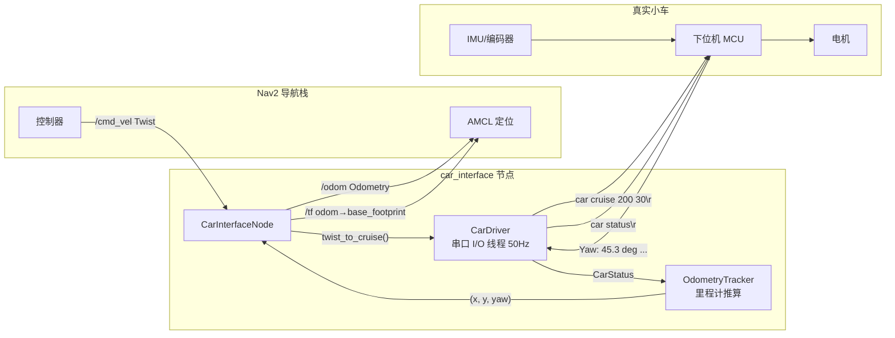

# car_interface

[](https://docs.ros.org/en/humble/)
[](./LICENSE)
[](https://www.python.org/)

将**串口控制的小车**接入 ROS2 Nav2 导航栈的桥接包。

## 概述

`car_interface` 是一个 ROS2 (Humble) Python 包，它充当 **Nav2 导航栈** 和 **串口协议小车** 之间的桥梁。包在后台线程中通过串口周期性地查询小车状态（`car status`），推算里程计并发布 `/odom` 和 `/tf`；同时订阅 Nav2 控制器发出的 `/cmd_vel`，将其转换为小车的 `car cruise` 指令发送。

本包设计用于多机器人场景，通过命名空间（`/tb1`、`/tb2` …）隔离各小车的话题，可直接替代仿真中的 Gazebo 模型。

### 架构图



## 功能

- ✅ **串口协议桥接** — 将 ROS2 `Twist` 消息转换为 `car cruise <mm/s> <deg/s>` 指令
- ✅ **里程计推算** — 通过周期查询 `car status` 的偏航角和速度，积分得到位姿
- ✅ **TF 广播** — 发布 `odom → base_footprint` 变换供 TF 树使用
- ✅ **多机器人支持** — 命名空间隔离，每台小车独立运行一个节点实例
- ✅ **安全保护** — speed指令去重避免小车卡顿、速度限幅、串口断线自动重连
- ✅ **参数可配置** — 串口路径、波特率、查询频率、速度上限等均可通过 ROS2 Parameter 调整

## 通信协议

小车通过 USB 虚拟串口与上位机通信，使用文本协议：

| 方向 | 指令 | 说明 |
|------|------|------|
| 上位机 → 小车 | `car cruise <mm/s> <deg/s>` | 设置目标线速度和角速度 |
| 上位机 → 小车 | `car status` | 查询当前状态 |
| 小车 → 上位机 | `Cruise: xxx mm/s, turn xxx deg/s` | cruise 确认响应 |
| 小车 → 上位机 | 多行状态块（见下） | status 查询响应 |

**status 响应格式**：

```
--- Car Status ---
Yaw:   45.3 deg (total 45.3, circles 0)
V_Lin: 198.2 / 200.0 mm/s  (cur / tgt)
V_Ang: 28.7 / 30.0 deg/s (cur / tgt)
Stop:  NO
```

> **注意**：命令结尾可使用 `\r\n`、`\r` 或 `\n`。小车返回以 `\r\n` 结尾，响应结束后输出 `\r\n> ` 提示符。

## 前置条件

- **操作系统**：Ubuntu 22.04
- **ROS2 发行版**：Humble (或其他支持 Python 3.10+ 的发行版)
- **Python**：3.10+
- **系统依赖**：
  
  ```bash
  pip3 install pyserial
  ```
- **硬件**：小车通过 USB 虚拟串口连接到上位机（如 `/dev/ttyUSB0`）

## 安装

```bash
# 1. 将包放入 ROS2 工作空间的 src 目录
cd ~/ros2_ws/src
# （假设已通过 git clone 或手动复制到此处）

# 2. 安装 Python 依赖
pip3 install pyserial

# 3. 编译
cd ~/ros2_ws
colcon build --packages-select car_interface

# 4. 加载环境
source install/setup.bash
```

## 快速开始

### 单台小车

```bash
# 启动 car_interface 节点（命名空间 tb1，串口 /dev/ttyUSB0）
ros2 launch car_interface car_bringup_launch.py \
    port:=/dev/ttyUSB0 \
    robot_name:=tb1
```

节点启动后，`/tb1/odom` 和 `/tb1/tf` 将开始发布，同时监听 `/tb1/cmd_vel`。

### 配合 Nav2 使用

`car_interface` 本身不包含导航功能，它只负责**发布里程计**和**接收速度指令**。需要与以下组件配合使用：

| 组件 | 作用 |
|------|------|
| `slam_toolbox` | SLAM 建图，订阅 `/scan`，发布 `/map` 和 `map→odom` 的 TF |
| `nav2_bringup` | 导航栈，包含 AMCL 定位 + 路径规划 + 控制器 |
| `car_interface`（本包） | 连接真实小车，发布 `/odom`，接收 `/cmd_vel` |

完整的 Launch 集成示例：

```python
# 在你的主 launch 文件中包含 car_interface
from launch_ros.actions import Node

# 小车 1
Node(
    package='car_interface',
    executable='car_interface_node',
    namespace=['/tb1'],
    parameters=[{'port': '/dev/ttyUSB0', 'baudrate': 115200}],
)

# 小车 2
Node(
    package='car_interface',
    executable='car_interface_node',
    namespace=['/tb2'],
    parameters=[{'port': '/dev/ttyUSB1', 'baudrate': 115200}],
)
```

### 手动运行节点

```bash
# 不使用 launch，直接运行节点
ros2 run car_interface car_interface_node \
    --ros-args \
    -p port:=/dev/ttyUSB0 \
    -r __ns:=/tb1
```

### 控制能力测试

使用键盘控制包发送 `cmd_vel`，推荐下面的包：

```shell
# 1. 安装（如果还没装）
sudo apt install ros-humble-t
eleop-twist-keyboard

# 2. 启动 — 注意要发布到正确命名空间下的话题
ros2 run teleop_twist_keyboard teleop_twist_keyboard \
    --ros-args -r cmd_vel:=/tb1/cmd_vel

# 或者使用这个图形化的
ros2 run rqt_robot_steering rqt_robot_steering
```

在 RViz 中可视化 `tb1/odom`。

1. **Fixed Frame** 设为 `tb1/odom`
2. 添加 **TF** 显示 → 可以看到 `odom` → `base_footprint` 的坐标轴
3. 添加 **Odometry** 显示 → 话题设为 `/tb1/odom` → 可以看到轨迹箭头
4. 遥控小车移动 → 轨迹应实时更新

## 话题

| 话题 | 消息类型 | 方向 | 说明 |
|------|----------|------|------|
| `cmd_vel` | `geometry_msgs/Twist` | 订阅 | 来自 Nav2 控制器，经转换后发往串口 |
| `odom` | `nav_msgs/Odometry` | 发布 | 推算的里程计（供 AMCL 等定位组件使用） |
| `tf` | `tf2_msgs/TFMessage` | 发布 | `odom → base_footprint` 坐标变换 |

> 在多机器人场景中，所有话题均带命名空间前缀，如 `/tb1/cmd_vel`、`/tb1/odom`。

## 参数

所有参数均为 ROS2 Parameter，可通过命令行或 launch 文件配置：

| 参数 | 类型 | 默认值 | 说明 |
|------|------|--------|------|
| `port` | string | `/dev/ttyUSB0` | 串口设备路径 |
| `baudrate` | int | `115200` | 串口波特率（USB 虚拟串口可任意设） |
| `odom_frame` | string | `odom` | 里程计坐标系 frame_id |
| `base_frame` | string | `base_footprint` | 机器人本体 frame_id |
| `status_rate` | double | `20.0` | 状态查询与里程计发布频率 (Hz) |
| `max_linear_mms` | double | `500.0` | 线速度上限 (mm/s) |
| `max_angular_degs` | double | `180.0` | 角速度上限 (deg/s) |

**命令行设置参数示例**：
```bash
ros2 run car_interface car_interface_node --ros-args \
    -p port:=/dev/ttyUSB0 \
    -p max_linear_mms:=300.0
```

## 项目结构

```
car_interface/
├── package.xml                       # ROS2 包描述（依赖声明）
├── setup.py                          # Python 包安装入口（console_scripts）
├── setup.cfg                         # setuptools 配置
├── resource/
│   └── car_interface                 # ament 索引标记文件
├── config/
│   └── car_params.yaml               # 默认参数配置文件
├── launch/
│   └── car_bringup_launch.py         # 启动文件（支持参数化启动）
└── car_interface/                    # Python 源码
    ├── __init__.py                   # 包标记
    ├── serial_protocol.py            # 串口协议解析 & 命令构造 & 单位转换
    ├── car_driver.py                 # 串口 I/O 管理线程（核心）
    ├── odometry_tracker.py           # 里程计推算器
    └── car_interface_node.py         # ROS2 主节点
```

### 模块职责

| 模块 | 职责 |
|------|------|
| `serial_protocol.py` | 解析 `car status` 响应文本 → `CarStatus` 数据结构；构造 `car cruise` / `car status` 命令；ROS ↔ 小车单位转换 |
| `car_driver.py` | 在独立线程中以 50Hz 固定频率运行 I/O 循环：查询状态 / 发送 cruise 指令；线程安全的状态读写；串口自动重连 |
| `odometry_tracker.py` | 根据连续 `CarStatus` 的快照，积分线速度推算 (x, y)，直接使用小车偏航角作为 θ；首次偏航角作零偏 |
| `car_interface_node.py` | ROS2 节点本体：订阅 `/cmd_vel`、定时发布 `/odom` 和 `/tf`、`cmd_vel` 超时安全保护 |

## 工作原理

### 1. I/O 循环（CarDriver 线程，50Hz）

```
每个周期（20ms）:
  ├── 检查是否有待发送的 cruise 指令
  │   ├── 有 → 与上次已发送值比较
  │   │   ├── 值变化 → 发送 "car cruise <lin> <ang>\r\n"
  │   │   │            读取确认，记录日志
  │   │   └── 值未变 → 跳过发送（去重，避免小车卡顿）
  │   └── 无 → 跳过
  └── 查询 "car status\r\n"
       读取并解析状态响应
       更新共享状态 latest_status（线程安全）
```

### 2. 里程计推算

$$
x_{t+1} = x_t + v_{\text{lin}} \cdot \cos(\theta_t) \cdot \Delta t
$$

$$
y_{t+1} = y_t + v_{\text{lin}} \cdot \sin(\theta_t) \cdot \Delta t
$$

$$
\theta_{t+1} = \text{yaw}_{\text{raw}} - \text{yaw}_{\text{offset}}
$$

- 偏航角 $\theta$ 直接使用小车上报的绝对值（来自其自带 IMU/磁力计），不会漂移累积
- 位置 $(x, y)$ 通过对线速度在偏航角方向上积分得到odom
- 首次收到的偏航角作为零偏，保证 `odom` 从 $(0, 0, 0)$ 开始

### 3. 安全保护

| 机制 | 触发条件 | 行为 |
|------|----------|------|
| cruise 去重 | ROS 高频重复下发相同速度指令 | 跳过发送，避免小车固件反复处理导致卡顿 |
| 速度限幅 | cmd_vel 指令超过 `max_linear_mms` / `max_angular_degs` | 裁剪到上限 |
| 串口断连 | 读写异常 | 指数退避自动重连（初始 2s，最大 10s） |

## 常见问题

### Q: 串口无法打开？

```bash
# 检查串口设备是否存在
ls -la /dev/ttyUSB*

# 检查当前用户是否有读写权限
sudo usermod -a -G dialout $USER
# 重新登录后生效
```

### Q: 里程计不更新？

1. 确认串口已连接：节点日志中出现 "串口已打开" 信息
2. 确认小车正常响应：用 `screen` 或 `minicom` 手动发送 `car status` 测试
3. 检查命名空间：确保 AMCL 订阅的是正确的 `/odom` 话题（带命名空间）

### Q: 小车不响应速度指令？

1. 检查串口接线（TX/RX 是否正确交叉）
2. 确认波特率匹配
3. 确认小车未处于急停状态（`Stop: YES`）

### Q: 如何配合 multi_robot_exploration 使用？

将主 launch 文件中的 Gazebo 仿真部分替换为 `car_interface` 节点即可。每个机器人的命名空间保持不变（`/tb1`、`/tb2` …），`car_interface` 会自动将话题发布到正确的命名空间下。

## 许可

MIT License
